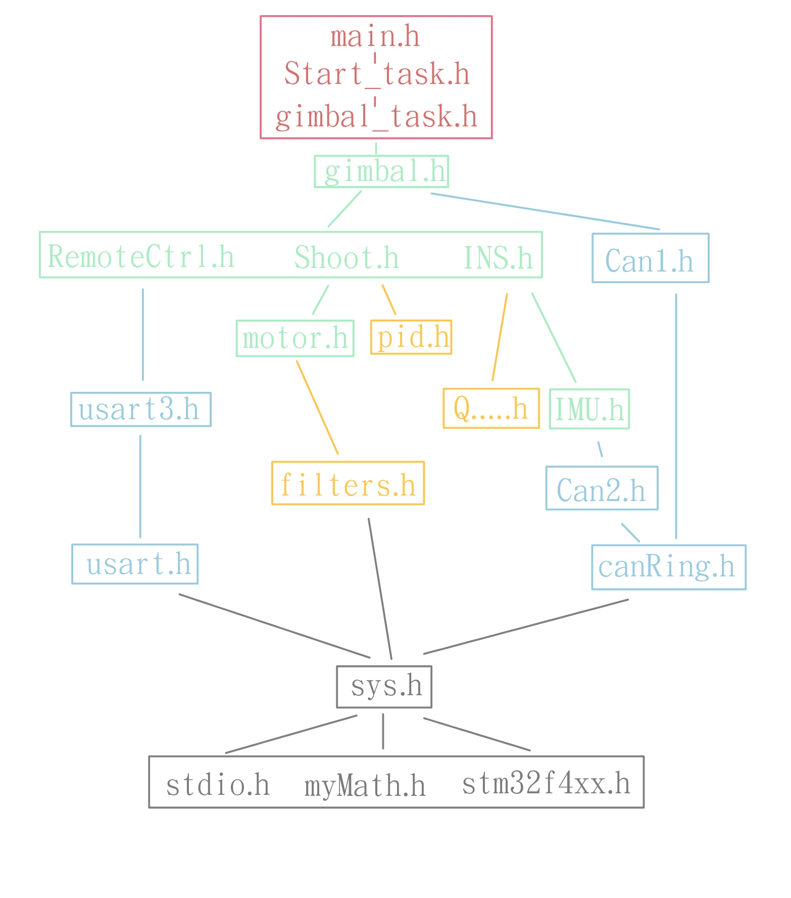
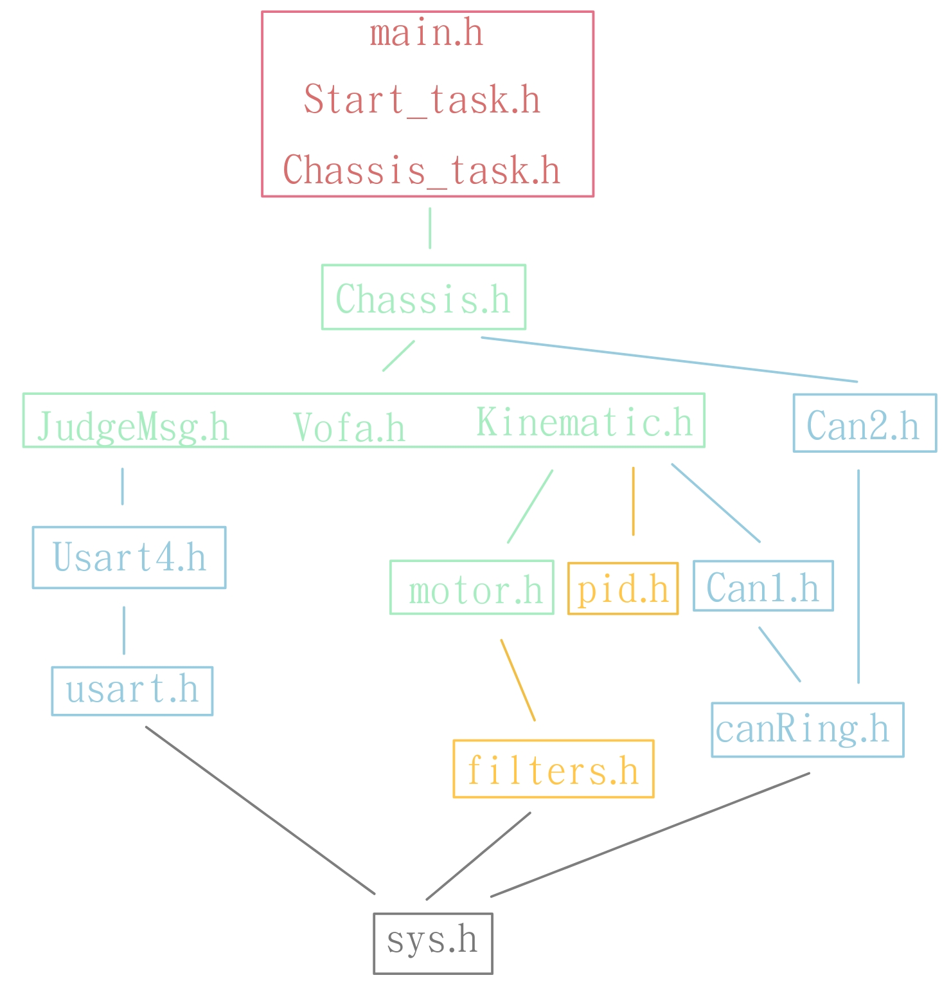
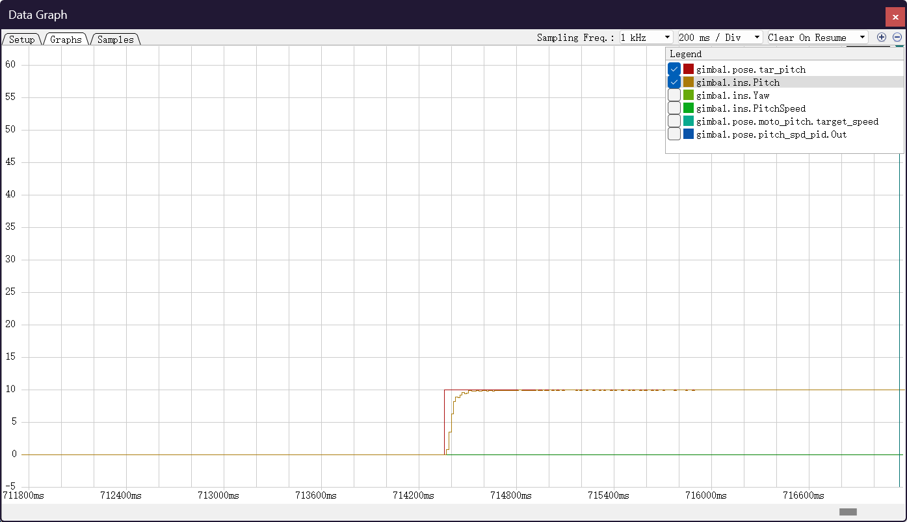

# Infantry-下供弹步兵

## 前言

​	这次考核我尝试了将步兵代码进行重构，并完成一些基本功能。新的代码主要从**面向对象**的角度出发，涉及到**常用硬件接口、常用算法封装、机器人各部件封装**等。新的代码有很多地方参考了原来的工程代码，也十分感激历届学长学姐的工作，使我能站在巨人的肩膀上进行新工程的开发，参与此次考核。

​	原来的工程已经有了完备稳健的功能，也经过了长时间的实践验证，但是我觉得它可能还不是很便于继承与二次开发，这也是我想尝试重新撰写代码的原因之一。结合参与考核过程中实际体验，我觉得可能存在以下几方面的问题：

- 头文件引用方式不太健康，循环引用，编译效率低，容易因为文件编译顺序问题导致报错，同一个地方的错误会被编译器多次报错；
- 易产生依赖性，变量声明和引用的位置比较随机，代码之间耦合度过高，你中有我我中有你，错综复杂，各功能模块难以独立使用或移植；
- 有一些注释可能是跟代码一块复制过来的，代码修改了而注释没有修改，容易让人产生误解。

​	目前的新代码可实现一定的基本功能，然而其完整度还远远不够，部分新想法仍处于理论阶段，有待进一步实践验证。


## 代码规范

### 命名规范

命名总体依据*《RM2022嵌软组编程规范》*，不过有一些地方没有严格依据此规范，有以下三种情况:

- 一开始没记清楚，**结构体类型定义**使用的是大驼峰，而**结构体变量**与**一般变量**混淆，均使用了一般变量命名规范
- 在常见数据结构对象中，特定变量类型相对固定化，从使命名更简洁的角度出发，没有额外添加命名标识。
- 直接沿用了老代码中的一些功能模块，暂时没有全部修改掉。


### 函数

一段代码是否有必要封装成函数，大概可以从这三个角度来看：

- **按功能来写**：将实现某一功能的代码块集合封装起来，可以提高代码可读性，使**主干代码**更简明清晰，便于替换。
- **按调用来写**：如果有一些代码相似度比较高，多次出现，那么便考虑封装起来，比如原先Gimbal代码中向各个电机发送电流这一部分，或者对不同数据使用低通滤波一部分。
- **按对象来写**：如果一部分代码应当作为某一个对象应有的功能，那么应该封装起来，并附属在对象中，也可以提高互换性。


### 对象封装与分类

​	大致可以分为**常用硬件接口、常用算法封装、机器人各部件封装**，任务层可直接调用相对完整的对象接口来进行状态更新，行为决策等，因此，文件大致分放至4个文件夹

- **Algorithm : ** 常用算法封装
- **Hardware : ** 系统与引脚配置
- **Software : **   机器人各部件的抽象与封装
- **Tasks : **          任务调度

具体文件关系可参考下一部分的 *头文件管理图*


### 头文件管理

​	新的工程避免了头文件之间的循环引用，采用层层引用的方式，这也为各个功能模块的**独立性、互换性、可移植性**提供了保障。

下面两张图列出了大致的头文件关系，不过限于画板大小，并没有展示所有的头文件关系。

- <font color='red'>红色 : Tasks</font>

- <font color='green'>绿色 : Software</font>
- <font color='blue'>蓝色 : Hardware</font>

- <font color='orange'>橙色 : Algorithm</font>

- <font color='grey'>灰色 : 标准库与个人库</font>

#### Gimbal



#### Chassis



接下来开始具体介绍各个结构体的功能，更为详细的代码说明可能要等之后总结一个 *调试日志* 一并写出。


## Hardware

​	串口，can通信之类的外设，因为他们的中断函数是固定的，想要在中断函数里处理数据，便常常需要引用上层变量，这就会导致相互引用的问题。所以我尝试将他们的中断状态与数据封装起来，上层可以根据外设的状态便可以适时处理数据。同时接口相同，也可以方便上层修改要用的外设。

### Usart接口

> 位于 **usart.h**

```c
/**
 * @brief 串口统一接口 usart interface
 * @note 其实也像是对标准库的一点补充？添加了一些常用的标志或变量
*/
typedef struct __UsartIF_t{
    uint8_t rx_flag;        //接收完成标志
    uint8_t *rx_buf;        //接收缓冲区
    uint8_t tx_flag;        //发送完成标志
    uint8_t *tx_buf;        //发送缓冲区
}UsartIF_t;

void usartIfInit(UsartIF_t *usart_if, uint8_t rxbuf_len, uint8_t txbuf_len,void (*usart_init)(void));
```

​	通过对老代码的阅读，感觉串口消息的读取方式更多为判断是否已经接收到数据，然后选择读取数据。上层选择应该分配到的Usart接口，根据需要的数据长度**动态分配**缓冲区的长度，之后再适时读取或发送数据即可。

​	通过封装之后，下层的**Usart**代码无需知晓上层指定的**缓冲区地址**，上层只需要**单向引用**即可，并且如果需要更换接口的话，只需要修改自身的串口指针即可。


### Can接口

​	大致思路为**中断函数**中将消息添加到缓冲区域，更新状态。上层使用的时候直接读取缓存器中**最新的数据**即可。

#### 链表实现

> 位于 **Can.h**

``` c
/**
 * can消息节点
*/
typedef struct __CanMsgNode_t {
    CanRxMsg msg;
    struct __CanMsgNode_t *next;
    struct __CanMsgNode_t *prev;
}CanMsgNode_t;

/**
 * can消息 双向链表
*/
typedef struct __CanMsgList_t {
    uint8_t num;
    CanMsgNode_t *head;
    CanMsgNode_t *tail;
    SemaphoreHandle_t mutex;    // 互斥信号量
}CanMsgList_t;

void addCanMsg(CanMsgList_t* list, CanRxMsg new_msg);
```

​	在一开始我尝试使用**链表**来作为缓冲器，但是较为繁琐，容易内存泄漏，所以之后又换了一种方式。

#### 环形缓存器

> 位于 **CanRing.h**

```c
/**
 * @brief  CAN消息环形缓存器结构体
*/
typedef struct __CanRing_t {
    CanRxMsg msg[CAN_RING_SIZE];
    short head;
    short tail;
}CanRing_t;

void pushCanMsg(CanRing_t *ring, CanRxMsg new_msg);
uint8_t canRingHasMsg(CanRing_t *ring);
CanRxMsg popCanMsg(CanRing_t *ring);
```

​	在中断函数中将接收到的数据使用`pushCanMsg` 将数据添加到缓存器中，上层将自己的**缓存器指针**赋值为分配到的缓存器，在需要读取数据的时候使用` popCanMsg`读取最新数据即可。


## Algorithm

### 矩阵运算库

> 位于 **Matrix.h**

```c
/**
 * @brief 
 * @param m 行数
 * @param n 列数
 * @param matrix 矩阵
 */
typedef struct __Matrix_t{
    int m;
    int n;
    double matrix[INV][INV];
}Matrix_t;

Matrix_t get_I(int t);
Matrix_t inv_matrix(Matrix_t M);
Matrix_t tran_matrix(Matrix_t M);
Matrix_t matrix_init2(int m, int n);
void swap_col(int i, int j, Matrix_t *M);
void swap_row(int i, int j, Matrix_t *M);
void fprintf_matrix(Matrix_t *mat, FILE *fp);
Matrix_t add_matrix(Matrix_t m1, Matrix_t m2);
Matrix_t sub_matrix(Matrix_t m1, Matrix_t m2);
Matrix_t mul_matrix(Matrix_t m1, Matrix_t m2);
Matrix_t numul_matrix(Matrix_t m1, double num);
Matrix_t numdiv_matrix(Matrix_t m1, double num);
void add_row(int i, int j, double k, Matrix_t *M);
void add_col(int i, int j, double k, Matrix_t *M);
Matrix_t matrix_init(int m, int n, double matrix[][INV]);
```

​	在实现 **递推最小二乘法** 和 **卡尔曼滤波器** 以及后续如果要继续使用到**现代控制理论**中相关算法的时候，C语言矩阵运算是不可避免的。这是我自己写的一个简易矩阵运算库，包含一些基本功能。

​	我使用这个库实现了一个卡尔曼滤波器的demo，应该是没有什么问题的（或许）。其实我有使用过其他人开源的一些运算库，但是感觉不太好用（比如一个库在运算的时候会将自身的值改变，debug才发现）。

​	不过这份代码仍然需要优化一下，因为省事我直接给**matrix**分配了 **INV x INV **的空间，但是这样显然是不够具有普适性的。比较好的一个写法是使用 **一阶指针** 动态分配空间，在运算时根据**m、n** 手动划分矩阵。


### 滤波器

> 位于 **filters.h**

#### 一阶低通滤波

```C
/**
 * @brief 一阶低通滤波器
 * 滤波系数也可以根据时间间隔和时间常数计算得到，
 * 不过步兵代码中直接给出了这几个参数值，
 * 所以这里把两种方式对应的函数都写了一下。
*/
#define K_CHASSIS 0.01f             // 底盘速度滤波系数
#define K_CHASSIS_STEERING 0.03f    // 舵轮底盘速度滤波系数
#define K_WHEEL 0.1f                // 电机速度滤波系数
#define K_CURRENT 0.1f              // 电机电流滤波系数

typedef struct __LowPass_t {
    float tf;           // 时间常数
    float K;        // 滤波系数
    float last;         // 上一次的输出
    TickType_t ts;      // 上一次时间戳
} LowPass_t;

void lowPassInit(LowPass_t *lp, float K);
void lowPassInitTS(LowPass_t *lp, float tf);
float lowPass(LowPass_t *lp, float input);
float lowPassTS(LowPass_t *lp, float input);
```

​	参考老代码，一阶低通滤波器使用`lowPassInit`、`lowPass`这两个函数即可。不过另外一种实现方式经过测试也是可以用的。

#### 卡尔曼滤波器

```C
typedef struct __KalmanFilter_t {
    Matrix_t x, P, Q, R, H, F, B, u, z, K;
    float dt, t;
} KalmanFilter_t;

void updateKF(KalmanFilter_t *kf, Matrix_t z);
```

​	暂时没用到。


### RLS-递推最小二乘

> 位于 **RLS.h**

```C
/**
 * @brief  Recursive Least Square
*/
typedef struct __RLS_t{
    int dim;             //维度
    Matrix_t theta;      //参数向量
    Matrix_t P;          //协方差矩阵
    float lambda;        //遗忘因子
}RLS_t;

void rlsInit(RLS_t *rls, int dim, double theta[][INV], double P[][INV], double lambda);
void rlsUpdate(RLS_t *rls, double *x_in, double y);
```

​	用于动态拟合**底盘电机功耗模型**的几个参数。相较于原先使用SD卡存储数据然后使用MATLAB进行拟合，使用RLS直接在开发板拟合是一种**在线**的拟合方式，在运行过程中，如果参数发生了一些变化也可以实时跟踪（不过不清楚是不是有必要）。拟合参数只有3个，运算量也不是很大，如果运算能力吃紧，也可以暂停拟合。


这是使用**RLS**算法对**有变化**的参数的拟合与跟踪，数据目前是随机生成的，还没有在车子上实际测试过。


### 常用数学工具

> 位于 **myMath.h**

#### 一元二次方程求解

```C
typedef struct __Roots_t{
    int isReal;     // 1 实数解，0 虚数解
    double Re[2];   // 实部
    double Im[2];   // 虚部
} Roots_t;

Roots_t solveQuadratic(double a, double b, double c);
```

​	

## Software

### Motor

> 位于 **Motor.h**

```C
typedef enum __MotorTypeEnum {
    RM2006,
    RM3508,
    RM6020
}MotorTypeEnum;

/**
 * 电机结构体
*/
typedef struct __Motor_t {
    MotorTypeEnum type_enum;    //电机类型
    float current_ratio;        //电流转换比例
    float rpm_rad;              //rpm转换为rad/s的比例
    float max_voltage;          //最大电压值
    float max_current;          //最大电流值

    uint16_t id;
    uint8_t temperature;
    float speed;                //速度, 单位为rad/s
    float last_speed;           //上一次的速度
    float target_speed;         //目标速度
    float current;              //电流, 单位为A
    short target_current;       //目标电流，因为与电调直接对接，所以先用short类型，为16位有符号整型
    float angle;                //角度, 原始角度为0-8191，对应0-360度
    float last_angle;           //上一次的角度
    uint8_t revolutions;        //转数

    LowPass_t lp_spd;           //速度低通滤波器
    LowPass_t lp_cut;           //电流低通滤波器
}Motor_t;
```

​	电机状态（如speed、angle）直接使用**float**类型，在**更新函数**中已经进行了转化。新工程中具有物理意义的变量都使用**标准单位**。


### Kinematic

> 位于 **Kinematic.h**

```C
/**
 * 运动学结构体
 * 理论上来说，电机控制接口应该是与电机封装在一起的，但是我们用的都是Can通信电机，
 * 发送一次信息可以控制多个电机，所以这里就和can绑定了
*/
typedef struct __Kinematic_t {    
    Velocity_t real_vel;                            //实际速度
    Velocity_t target_vel;                          //目标速度

    Motor_t motor[4];                               //电机
    Pid_t pid_speed[4];                             //速度环pid
    Pid_t pid_angle[4];                             //角度环pid

    Motor_t steering_motor[4];                      //舵轮转向电机
    Pid_t steering_pid_angle[4];                    //舵轮转向角度环pid
    Pid_t steering_pid_speed[4];                    //舵轮转向速度环pid

    CanRing_t *can_ring;                            
    CanRing_t *can_ring_steering;                   
    CAN_TypeDef *can_tx;                            //can发送接口

} Kinematic_t;
void kinematicInit(Kinematic_t *kinematic, CAN_TypeDef *can_tx, CanRing_t *can_ring);
void forKinematic(Kinematic_t *kinematic);
void invKinematic(Kinematic_t *kinematic);
void updateWheels(Kinematic_t *kinematic);
void setMotorCurrent(Kinematic_t *kinematic);
```

​	我想让底盘根据不同的轮组类型自动分配不同的运动解算结构体（因为解算差异较大，似乎不好直接用函数），但是这样的话似乎没法在声明的时候就确定数据类型，所以最后采用了预编译的实现方式来进行选择。

​	这里的**Can**接口是由上层分配的，但是感觉一个函数将配置用的**形参**再传给下一个函数不是太合理，直接在本层配置通信接口也不错。


### Judge

> 位于 **JudgeMsg.h**

```C
/**
 * 裁判系统信息接收与处理结构体
*/
typedef struct __Judge_t {
    JudgeRecv_t recv_msg;           //接收消息
    UsartIF_t *usart_if;            //串口接口
    uint8_t *recv_flag;             //接收标志位，有新消息时为1
    uint8_t *send_flag;             //发送标志位，正在发送时为1

}Judge_t;

void judgeInit(Judge_t *judge, UsartIF_t *usart_if);
void recvJudgeMsg(Judge_t *judge);
```

​	可以使用与老代码中类似的逻辑来适时更新裁判数据，串口的**DMA**会自动覆盖数据，也就可以保证读取到的数据一直都是**最新消息**。


### Chassis

> 位于 **Chassis.h**

```C
/**
 * 底盘结构体
*/
typedef struct __Chassis_t {
    ChassisTypeEnum type_enum;                      //底盘类型
    StateFlag_t state;                              //状态标记
    Kinematic_t kinematic;                          //底盘运动控制结构体
    Judge_t judge;                                  //裁判系统结构体

    CAN_TypeDef  *gimbal_canTx;                     //云台发送接口
    CanRing_t *gimbal_canRx;                        //云台接收数据缓存器
    short pitch_100;                                //云台pitch角度*100
    short yaw_100;                                  //云台yaw角度*100
}Chassis_t;
```

​	功能目前只添加了**裁判系统、运动控制、板件通信**


### RemoteCtrl

> 位于 **RemoteCtrl.h**

```C
/**
 * @brief 遥控器键鼠接收结构体
*/
typedef struct __RC_t{
    Stick_t stick;
    Mouse_t mouse;                      
    Key_t key;                          
    uint8_t dis_cnt;                         //遥控器掉线计数

    UsartIF_t *usart_if;                  	 //串口接收结构体指针
}RC_t;

void remoteCtrlInit(RC_t *rc);
void updateRC(RC_t *rc);
```

​	检测`usart_if->rx_flag`即可判断有无数据，选择更新。


### IMU

> 位于 **IMU.h**

```C
/**
 * @brief IMU结构体
*/
typedef struct __IMU_t {
    float g_norm;                //重力加速度模值
    float gyro[3];               //角速度
    float gyro_offset[3];        //陀螺仪零偏
    float acc[3];                //加速度
    float acc_scale;             //加速度矫正比例

    CanRing_t *can_rx;
}IMU_t;

void imuInit(IMU_t *imu);
void recvData(IMU_t *imu);
void updateIMU(IMU_t *imu);
void calibrateIMU(IMU_t *imu);
```

​	参考老代码中的逻辑进行了封装，**矫正函数**进行了修改。


### INS

> 位于 **ins.h**

```C
typedef struct __INS_t {
    float q[4]; // 四元数估计值

    float Gyro[3];          // 角速度
    float Accel[3];         // 加速度
    float MotionAccel_b[3]; // 机体坐标加速度
    float MotionAccel_n[3]; // 绝对系加速度

    float AccelLPF; // 加速度低通滤波系数

    // 加速度在绝对系的向量表示
    float xn[3];
    float yn[3];
    float zn[3];

    float atanxz;
    float atanyz;

    // 位姿
    float Roll;
    float Pitch;
    float Yaw;
    float YawTotalAngle;
    float LastYaw;
    float LastPitch;
    
    //速度
    float PitchSpeed;
    float YawSpeed;
    float PitchLastSpeed;
    float YawLastSpeed;
    float PitchSpeedLPF;                    //角速度低通滤波系数
    float YawSpeedLPF;
    
    IMU_t imu;
    SemaphoreHandle_t mutex;            //互斥锁
} INS_t;
```

​	这个基本是直接沿用的老代码中的结构体，添加了一个 **imu** 成员，只要保证**IMU**给出的接口是一样的，即使换了一种类型的imu，也可以比较方便的更新代码。

​	添加**互斥锁**是因为更新和读取 **ins**分别是在两个任务中进行的。


### Gimbal

> 位于 **Gimbal.h**

```C
/**
 * @brief 云台位姿控制结构体
*/
typedef struct __GimPosture_t {
    float tar_yaw;              //目标yaw轴角度，单位 度
    float tar_pitch;            //目标pitch轴角度，单位 度
    float theta;                //云台正方向与底盘正方向夹角，弧度制
    float theta0;               //初始角度
    uint8_t yaw_mode;           //yaw轴控制模式,0:位置模式 1:速度模式
    Motor_t moto_yaw;           //yaw轴电机
    Motor_t moto_pitch;         //pitch轴电机
    Pid_Typedef yaw_spd_pid;    //yaw轴速度pid
    Pid_Typedef pitch_spd_pid;  //pitch轴速度pid
    Pid_Typedef yaw_pos_pid;    //yaw轴位置pid
    Pid_Typedef pitch_pos_pid;  //pitch轴位置pid
    //CanRing_t *pit_can_rx;      //似乎没必要，直接用宏定义

}GimPosture_t;

void posUpdate(GimPosture_t *pose);

/**
 * @brief 云台结构体
*/
typedef struct __Gimbal_t {
    RC_t rc;                    //遥控器结构体
    INS_t ins;                  //惯导结构体
    Shoot_t shoot;              //射击结构体
    Velocity_t vel;             //速度 云台坐标系
    GimPosture_t pose;          //云台位姿控制结构体
    ChassisInfo_t chassis;      //底盘交互信息
}Gimbal_t;
```


## 部分功能测试

​	暂时能调试的功能不是很多，粗调了一下云台和底盘电机

这是云台响应曲线


